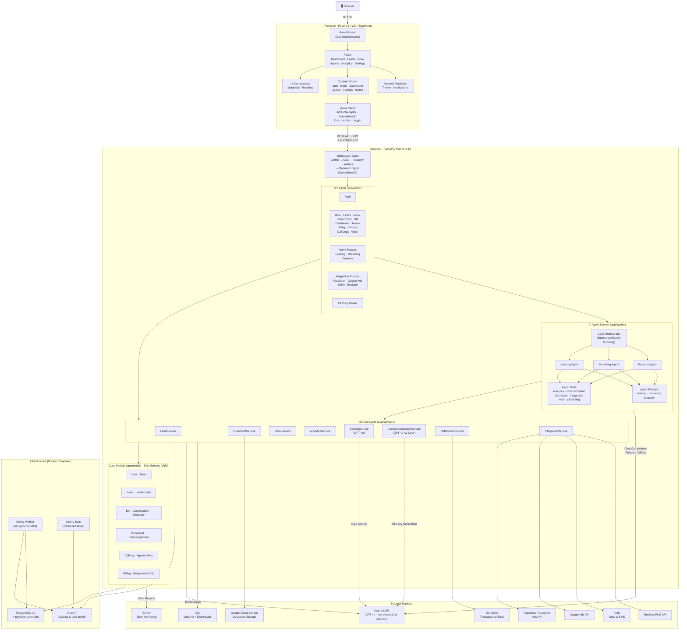

# Loriaa AI — Overall Application Architecture

> **Version 2.0.0** | Enterprise AI-Powered Property Management CRM  
> Python 3.13 · React 18 · PostgreSQL 15 (pgvector) · Redis 7 · OpenAI GPT-4o

This document provides a comprehensive overview of the Loriaa AI platform, covering the frontend client, backend API, infrastructure services, external integrations, and data flows.

---

## 1. High-Level Architecture Diagram



---

## 2. Frontend — React 18 / Vite / TypeScript

The frontend is a single-page application that provides the complete user interface for the Loriaa AI CRM.

### 2.1 Technology Stack

| Layer | Technology | Purpose |
|---|---|---|
| Build Tool | **Vite 6** | Fast HMR, ESBuild-powered bundling |
| Framework | **React 18** | Component-based UI with lazy-loaded routes |
| Language | **TypeScript** | Type safety across the entire frontend |
| UI Library | **shadcn/ui** (Radix primitives + Tailwind CSS) | Accessible, composable component system |
| State | **Zustand 5** (with `persist` middleware) | Lightweight global stores with localStorage persistence |
| HTTP Client | **Axios** | REST communication with request/response interceptors |
| Routing | **React Router 6** | Client-side routing with auth guards |
| Charts | **Recharts** | Data visualization for analytics and dashboards |
| Testing | **Vitest** + React Testing Library + MSW | Unit & integration tests with API mocking |
| Styling | **Tailwind CSS 3.4** + `tailwindcss-animate` | Utility-first CSS with animation support |

### 2.2 Application Structure

```
src/
├── App.tsx                  # Root component: providers, router, layout
├── pages/                   # Route-level components (lazy-loaded)
│   ├── DashboardPage.tsx    # KPI cards + analytics charts
│   ├── LeadsPage.tsx        # Lead Kanban board
│   ├── InboxPage.tsx        # Conversation threads
│   ├── AnalyticsPage.tsx    # Recharts-powered analytics
│   ├── TeamPage.tsx         # Team members & invites
│   ├── SettingsPage.tsx     # App configuration
│   ├── Login.tsx            # Authentication form
│   └── agents/              # AI agent chat interfaces
│       ├── LeasingAgentPage.tsx
│       ├── MarketingAgentPage.tsx
│       └── PropertyManagerPage.tsx
├── components/
│   ├── layout/              # AppShell, Sidebar
│   ├── common/              # DataTable, KanbanBoard, StatusBadge, etc.
│   ├── ui/                  # shadcn primitives (button, dialog, card...)
│   ├── leads/               # AddLeadModal
│   └── team/                # InviteMemberModal
├── stores/                  # Zustand global state
│   ├── authStore.ts         # Auth state + JWT persistence
│   ├── leadsStore.ts        # Lead CRUD + scoring
│   ├── dashboardStore.ts    # Dashboard metrics & analytics
│   ├── agentStore.ts        # AI agent chat history
│   ├── teamStore.ts         # Team management
│   ├── settingsStore.ts     # User preferences
│   └── documentStore.ts     # Document uploads
├── services/api.ts          # API service layer (backend calls)
├── lib/
│   ├── axios.ts             # Configured Axios instance + interceptors
│   ├── errorHandler.ts      # Error classification & context extraction
│   └── logger.ts            # Structured client-side logging
├── contexts/                # React contexts (Theme, Notifications)
├── hooks/                   # Custom hooks (use-toast, use-mobile)
├── config/api.ts            # API base URL configuration
└── types/index.ts           # Shared TypeScript interfaces
```

### 2.3 Key Architectural Patterns

- **Lazy Loading**: All page components are imported with `React.lazy()` and wrapped in `<Suspense>`, so the initial bundle only contains the shell and login page.
- **Auth Guard**: A `<PrivateRoute>` wrapper checks `authStore.isAuthenticated` and redirects unauthenticated users to `/login`.
- **Correlation Tracking**: Every Axios request is tagged with a unique `X-Correlation-ID` header, enabling end-to-end request tracing between the frontend logger and backend request logs.
- **Interceptor Pipeline**: The Axios instance runs two interceptors:
  - **Request**: Injects `Bearer <JWT>` from localStorage and attaches the correlation ID.
  - **Response**: Logs successful responses; on `401 Unauthorized`, clears the token and redirects to login.

---

## 3. Backend — FastAPI / Python 3.13

The backend is a versioned REST API that handles authentication, business logic, AI agent orchestration, and external integrations.

### 3.1 Technology Stack

| Layer | Technology | Purpose |
|---|---|---|
| Framework | **FastAPI** | Async API framework with auto-generated OpenAPI docs |
| Language | **Python 3.13** | Latest Python with performance improvements |
| ORM | **SQLAlchemy** (sync + async) | Database modeling, queries, connection pooling |
| Config | **Pydantic Settings** | Type-safe `.env` configuration |
| AI | **OpenAI Python SDK** | GPT-4o chat completions + function calling + embeddings |
| Background | **Celery** + Redis broker | Async task processing and scheduled jobs |
| Auth | **JWT (HS256)** via `python-jose` / `passlib` | Stateless token-based authentication |
| Testing | **pytest** | Service and API integration tests |

### 3.2 Application Structure

```
app/
├── main.py                  # Application factory + middleware + route registration
├── database.py              # Engine, session management, pool config, health checks
├── core/
│   ├── config.py            # Pydantic Settings (all env vars)
│   ├── security.py          # Password hashing, JWT creation/verification, headers
│   ├── embeddings.py        # OpenAI text-embedding-ada-002 integration
│   ├── exceptions.py        # Custom exception hierarchy + handlers
│   └── logging.py           # Structured logging configuration
├── models/                  # SQLAlchemy ORM models (14 tables)
│   ├── user.py              # Users & authentication
│   ├── team.py              # Teams & memberships
│   ├── lead.py              # Leads with scoring & status tracking
│   ├── lead_activity.py     # Lead interaction timeline
│   ├── bot.py               # Voice/chat bot configurations
│   ├── conversation.py      # Conversation threads
│   ├── message.py           # Individual messages within conversations
│   ├── document.py          # Uploaded documents
│   ├── knowledge_base.py    # Vector knowledge base entries (pgvector)
│   ├── call_log.py          # Voice call records
│   ├── agent_activity.py    # AI agent action audit log
│   ├── billing.py           # Subscription & usage billing
│   └── integration_config.py# Third-party integration settings
├── api/v1/                  # API routers (versioned under /api/v1)
│   ├── auth.py              # Login, registration, token refresh
│   ├── leads.py             # Lead CRUD, search, bulk operations
│   ├── inbox.py             # Conversations & messaging
│   ├── documents.py         # File upload/download
│   ├── dashboard.py         # Metrics & analytics aggregation
│   ├── bots.py              # Bot CRUD & deployment
│   ├── knowledge_base.py    # KB document ingestion & vector search
│   ├── voice.py             # Voice AI configuration (Vapi)
│   ├── ad_copy.py           # GPT-4o ad copy generation
│   ├── call_logs.py         # Call history
│   ├── teams.py             # Team management
│   ├── billing.py           # Subscription management
│   ├── settings.py          # User/app settings
│   ├── agents/              # AI agent chat endpoints
│   │   ├── leasing.py
│   │   ├── marketing.py
│   │   └── property.py
│   └── integrations/        # Third-party integration endpoints
│       ├── facebook.py
│       ├── google_ads.py
│       ├── twilio.py
│       └── resman.py
├── services/                # Business logic layer
│   ├── lead_service.py      # Lead management & pipeline
│   ├── document_service.py  # File storage (GCS) & metadata
│   ├── inbox_service.py     # Conversation threading
│   ├── analytics_service.py # Metrics aggregation
│   ├── scoring_service.py   # AI lead scoring (GPT-4o)
│   ├── content_generation_service.py  # Ad copy generation (GPT-4o)
│   ├── notification_service.py        # Email via SendGrid
│   ├── integration_service.py         # Third-party API orchestration
│   └── base_service.py      # Shared service utilities
├── agents/                  # AI agent framework
│   ├── base.py              # BaseAgent: OpenAI client, function-calling, logging
│   ├── orchestrator.py      # COO Agent: intent classification & routing
│   ├── workforce/           # Specialist agents
│   │   ├── leasing_agent.py
│   │   ├── marketing_agent.py
│   │   └── property_agent.py
│   ├── prompts/             # System prompts per agent type
│   │   ├── leasing_prompt.py
│   │   ├── marketing_prompt.py
│   │   └── property_prompt.py
│   └── tools/               # Callable functions for agents
│       ├── analytics_tools.py
│       ├── communication_tools.py
│       ├── document_tools.py
│       ├── integration_tools.py
│       ├── lead_tools.py
│       └── scheduling_tools.py
└── integrations/            # External API clients
    ├── facebook/            # Facebook Ads campaigns & leads
    ├── google_ads/          # Google Ads campaigns
    ├── twilio/              # Voice & SMS
    ├── vapi/                # Voice AI (Vapi + ElevenLabs)
    └── resman/              # ResMan PMS
```

### 3.3 Middleware Pipeline

Every request passes through a middleware stack configured in the application factory (`main.py`). The middleware executes in reverse registration order (last registered = first executed):

```
Incoming Request
    │
    ▼
┌──────────────────────────┐
│  CORS Middleware          │  Validates origin, sets Access-Control headers
├──────────────────────────┤
│  Request Logging          │  Generates X-Correlation-ID, logs method/path/duration
├──────────────────────────┤
│  Security Headers         │  X-Content-Type-Options, X-Frame-Options, etc.
├──────────────────────────┤
│  GZip Compression         │  Compresses responses > 1 KB
└──────────────────────────┘
    │
    ▼
  Route Handler
```

### 3.4 AI Agent Architecture

The agent system follows a **COO (Chief Operating Officer) orchestration pattern**:

1. **COO Orchestrator** receives a user message and classifies the intent into one of three domains: `leasing`, `marketing`, or `property`.
2. It routes the message to the appropriate **Specialist Agent**.
3. Each specialist agent is initialized with:
   - A **system prompt** defining its persona, responsibilities, and constraints.
   - A set of **callable tools** (Python functions) exposed via OpenAI's function-calling API.
4. The agent sends the prompt + tool schemas to **OpenAI GPT-4o**.
5. GPT-4o may respond with a function call (e.g., `search_leads`), which the agent executes locally against the database.
6. Tool outputs are sent back to GPT-4o for a final natural-language response.
7. All agent activity is logged to the `agent_activities` table for auditing.

```
User Message
    │
    ▼
┌─────────────────────┐
│   COO Orchestrator   │
│  (intent classifier) │
└────────┬────────────┘
         │ route
    ┌────┼────┐
    ▼    ▼    ▼
┌──────┐┌──────┐┌──────┐
│Leasing││Market││Prop. │
│Agent  ││Agent ││Agent │
└──┬───┘└──┬───┘└──┬───┘
   │       │       │
   ▼       ▼       ▼
┌──────────────────────┐
│   OpenAI GPT-4o       │
│  (function calling)   │
└──────────┬───────────┘
           │ tool call
           ▼
┌──────────────────────┐
│    Agent Tools        │
│  lead · scheduling    │
│  analytics · comms    │
│  document · integ.    │
└──────────┬───────────┘
           │ result
           ▼
┌──────────────────────┐
│   OpenAI GPT-4o       │
│  (final response)     │
└──────────────────────┘
```

---

## 4. Infrastructure — Docker Compose

The entire application is orchestrated with Docker Compose for local development and can be deployed to production.

| Service | Image / Build | Port | Purpose |
|---|---|---|---|
| **db** | `pgvector/pgvector:pg15` | 5432 | PostgreSQL 15 with pgvector for vector similarity search |
| **redis** | `redis:7-alpine` | 6379 | Caching layer and Celery message broker |
| **backend** | Custom Dockerfile | 8000 | FastAPI app served by Uvicorn |
| **frontend** | Custom Dockerfile | 3000 | Vite dev server (React SPA) |
| **celery-worker** | Same as backend | — | Background task processor (optional profile) |
| **celery-beat** | Same as backend | — | Scheduled task scheduler (optional profile) |

All services communicate over a shared Docker bridge network (`loriaa-network`). PostgreSQL and Redis data is persisted via named Docker volumes.

---

## 5. External Services & Integrations

### 5.1 AI / Machine Learning

| Service | SDK | Usage |
|---|---|---|
| **OpenAI GPT-4o** | `openai` Python SDK | Agent chat completions, function calling, lead scoring, ad copy generation |
| **OpenAI Embeddings** | `text-embedding-ada-002` | Document vectorization for knowledge base search (stored in pgvector) |

> **Note**: The Google API key in configuration is used **only** for Google Ads / Google My Business integrations — **not** for AI agent intelligence. All AI is powered exclusively by OpenAI.

### 5.2 Communication & Voice

| Service | Purpose |
|---|---|
| **Twilio** | Outbound/inbound voice calls and SMS messaging |
| **Vapi** | Voice AI platform for conversational voice bots |
| **ElevenLabs** | Premium text-to-speech voices (via Vapi integration) |
| **SendGrid** | Transactional email delivery (notifications, follow-ups) |

### 5.3 Advertising Platforms

| Service | Purpose |
|---|---|
| **Facebook / Instagram Ads** | Campaign management, lead form ingestion, performance metrics |
| **Google Ads** | Search & display campaign management, conversion tracking |

### 5.4 Property Management

| Service | Purpose |
|---|---|
| **ResMan PMS** | Resident data sync, unit availability, lease management |

### 5.5 Cloud & Monitoring

| Service | Purpose |
|---|---|
| **Google Cloud Storage** | Document & file storage for uploads |
| **Sentry** | Error tracking and performance monitoring |

---

## 6. Data Flow Examples

### 6.1 User Login

```
Browser → POST /api/v1/auth/login (email + password)
         → CORS → GZip → SecurityHeaders → RequestLogger
         → Auth Router → Security.verify_password()
         → DB: SELECT user WHERE email = ?
         ← JWT access_token (HS256)
         ← 200 OK
Browser ← Store token in localStorage
         → All future requests include: Authorization: Bearer <token>
```

### 6.2 AI Agent Chat (e.g., Leasing)

```
Browser → POST /api/v1/agents/leasing/execute (message + context)
         → Auth middleware (JWT validation)
         → Agent Router → COO Orchestrator
         → Intent classification → "leasing"
         → Leasing Agent → OpenAI GPT-4o (prompt + tool schemas)
         ← Function call: search_leads(query="...")
         → Lead Tools → DB query
         ← Tool results → GPT-4o
         ← Final natural-language response
         → Log to agent_activities table
         ← 200 OK + AgentResponse JSON
Browser ← Display response in agent chat
```

### 6.3 Ad Copy Generation

```
Browser → POST /api/v1/ad-copy/generate
           {platform: "facebook", objective: "lead_generation", property_details: {...}}
         → ContentGenerationService
         → Build platform-specific prompt (char limits, Fair Housing rules)
         → OpenAI GPT-4o (response_format=json)
         ← Parsed ad variations with headlines, CTAs, descriptions
         ← 200 OK + AdCopyResponse
Browser ← Display variations with copy-to-clipboard
```

### 6.4 Lead Scoring

```
Service trigger → ScoringService.calculate_lead_score(lead)
                → Gather: activity count, response times, source, budget, timeline
                → OpenAI GPT-4o (scoring prompt)
                ← Score (0-100) + explanation
                → Update lead.score in DB
```

---

## 7. Security Architecture

| Concern | Implementation |
|---|---|
| **Authentication** | JWT tokens (HS256) with configurable expiry (default: 30 min) |
| **Password Storage** | Bcrypt hashing via `passlib` |
| **CORS** | Configurable allowed origins; credentials enabled |
| **Security Headers** | `X-Content-Type-Options`, `X-Frame-Options`, `Strict-Transport-Security` |
| **Request Tracing** | `X-Correlation-ID` propagated from frontend → backend → logs |
| **API Docs** | Swagger/ReDoc disabled in production (`ENVIRONMENT=production`) |
| **Error Handling** | Custom exception hierarchy with structured JSON error responses |

---

## 8. Database Schema Overview

The PostgreSQL database (with **pgvector** extension) contains 14 core tables:

| Table | Key Fields | Notes |
|---|---|---|
| `users` | id, email, hashed_password, role | Authentication & authorization |
| `teams` | id, name, owner_id | Multi-tenant team structure |
| `leads` | id, name, email, phone, status, score, source | CRM lead pipeline |
| `lead_activities` | id, lead_id, type, description | Lead interaction audit trail |
| `bots` | id, name, type, config | Voice/chat bot configurations |
| `conversations` | id, lead_id, channel | Conversation threads |
| `messages` | id, conversation_id, content, sender | Individual messages |
| `documents` | id, filename, url, type | Uploaded files (GCS storage) |
| `knowledge_base` | id, content, embedding (vector) | pgvector-powered semantic search |
| `call_logs` | id, bot_id, duration, status | Voice call records |
| `agent_activities` | id, agent_type, action, result | AI agent action audit log |
| `billing` | id, team_id, plan, usage | Subscription & usage tracking |
| `integration_configs` | id, provider, credentials | Third-party API credentials |

---

## 9. Testing Strategy

| Layer | Tool | Scope |
|---|---|---|
| **Frontend Unit** | Vitest + React Testing Library | Component rendering, store logic, error handlers |
| **Frontend Mocking** | MSW (Mock Service Worker) | API response simulation |
| **Backend Unit** | pytest | Service logic, utility functions |
| **Backend Integration** | pytest + SQLAlchemy test sessions | API endpoint tests with database |
| **E2E** | (Planned) | Full browser-based flow testing |
