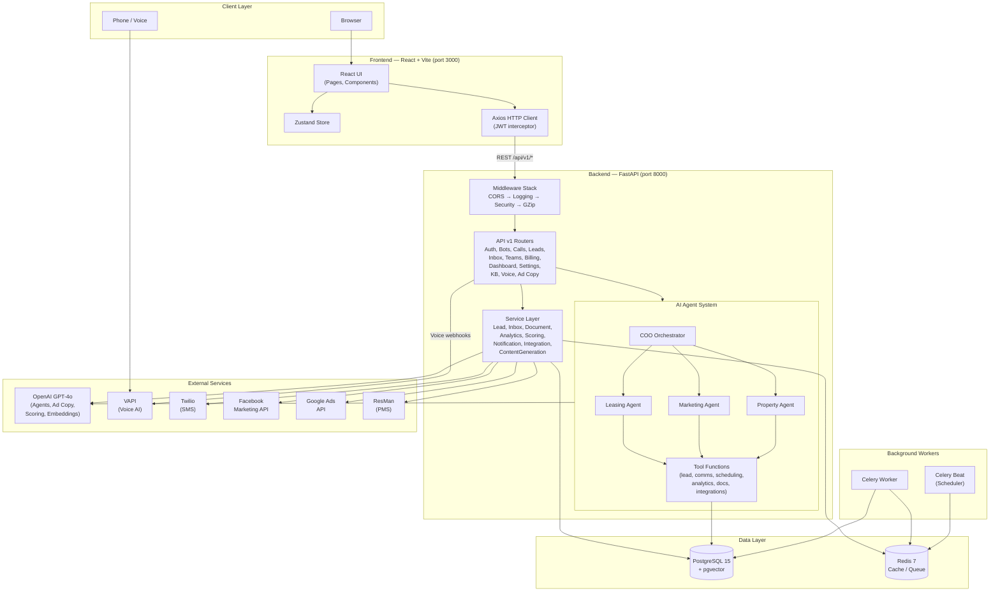

# Loriaa AI CRM — Backend

AI-powered property management CRM backend built with FastAPI, OpenAI GPT-4o agents, ad-copy generation, and VAPI voice integration.

## Tech Stack

| Layer | Technology |
|-------|-----------|
| Framework | FastAPI 2.0, Python 3.13 |
| Database | PostgreSQL 15 + pgvector |
| Cache | Redis 7 |
| AI Agents | OpenAI GPT-4o (function calling) |
| Ad Copy | OpenAI GPT-4o |
| Voice | VAPI (AI voice assistants) |
| Background Jobs | Celery |
| Auth | JWT (python-jose + bcrypt) |
| ORM | SQLAlchemy 2.x + Alembic migrations |
| Monitoring | Structlog, Sentry |

## Overall Architecture



> **See also:** [SEQUENCE_DIAGRAM.md](SEQUENCE_DIAGRAM.md) for detailed flow diagrams of every major operation.

## Prerequisites

### Required Software

| Software | Version | Download |
|----------|---------|----------|
| Git | 2.40+ | https://git-scm.com/downloads |
| Docker Desktop | 4.x+ | https://www.docker.com/products/docker-desktop/ |
| Python | 3.11+ | https://www.python.org/downloads/ |
| Node.js | 20 LTS | https://nodejs.org/ |
| Yarn | 1.22+ | https://classic.yarnpkg.com/en/docs/install |
| GitHub Desktop (optional) | Latest | https://desktop.github.com/ |

### Installation — Windows

1. **Git**
   - Download the installer from https://git-scm.com/downloads/win
   - Run the `.exe` and follow the wizard (defaults are fine)
   - Verify: open **PowerShell** and run:
     ```powershell
     git --version
     ```

2. **Docker Desktop**
   - Download from https://www.docker.com/products/docker-desktop/
   - Run the installer — enable **WSL 2 backend** when prompted
   - Restart your PC if asked
   - Launch Docker Desktop from the Start Menu and wait for the whale icon to become steady in the system tray
   - Verify:
     ```powershell
     docker --version
     docker compose version
     ```

3. **Python 3.11+**
   - Download from https://www.python.org/downloads/
   - **Check "Add Python to PATH"** during installation
   - Verify:
     ```powershell
     python --version
     pip --version
     ```

4. **Node.js 20 LTS**
   - Download the LTS installer from https://nodejs.org/
   - Run the `.msi` and follow the wizard
   - Verify:
     ```powershell
     node --version
     npm --version
     ```

5. **Yarn**
   - After Node.js is installed:
     ```powershell
     npm install -g yarn
     yarn --version
     ```

6. **GitHub Desktop (optional)**
   - Download from https://desktop.github.com/
   - Sign in with your GitHub account
   - Use it to clone repos with a GUI instead of the command line

### Installation — macOS

1. **Homebrew** (package manager — install first if you don't have it)
   ```bash
   /bin/bash -c "$(curl -fsSL https://raw.githubusercontent.com/Homebrew/install/HEAD/install.sh)"
   ```

2. **Git** (comes with Xcode CLT, or install via Homebrew)
   ```bash
   xcode-select --install   # easiest option
   # or
   brew install git
   git --version
   ```

3. **Docker Desktop**
   - Download the `.dmg` from https://www.docker.com/products/docker-desktop/
   - Drag to Applications, launch, and grant permissions
   - Verify:
     ```bash
     docker --version
     docker compose version
     ```

4. **Python 3.11+**
   ```bash
   brew install python@3.13
   python3 --version
   pip3 --version
   ```

5. **Node.js 20 LTS**
   ```bash
   brew install node@20
   node --version
   npm --version
   ```

6. **Yarn**
   ```bash
   npm install -g yarn
   yarn --version
   ```

7. **GitHub Desktop (optional)**
   - Download from https://desktop.github.com/

### Clone the Repositories

Using the command line:

```bash
# Create a project folder
mkdir ~/loriaa && cd ~/loriaa    # macOS / Linux
mkdir D:\loriaa && cd D:\loriaa   # Windows PowerShell

# Clone both repos side by side
git clone https://github.com/napandya/revised-loriaa-backend.git
git clone https://github.com/napandya/revised-loriaa-frontend.git
```

Or using **GitHub Desktop**: click **File → Clone Repository**, search for `napandya/revised-loriaa-backend` and `napandya/revised-loriaa-frontend`, and clone them into the same parent folder.

Your folder structure should look like:

```
loriaa/
├── revised-loriaa-backend/
└── revised-loriaa-frontend/
```

> **Important:** Both repos must sit side by side in the same parent directory. The `docker-compose.yml` in the backend repo references `../revised-loriaa-frontend` for the frontend build.

---

## Quick Start (Docker) — Recommended

```bash
cd revised-loriaa-backend

# 1. Copy environment file and fill in your keys
cp .env.example .env          # macOS / Linux
copy .env.example .env        # Windows CMD

# 2. Start all services
docker compose up -d

# 3. Seed the database
docker compose exec backend python scripts/seed_comprehensive.py
```

Services will be available at:

| Service | URL |
|---------|-----|
| Backend API | http://localhost:8000 |
| Swagger Docs | http://localhost:8000/docs |
| ReDoc | http://localhost:8000/redoc |
| Frontend | http://localhost:3000 |
| PostgreSQL | localhost:5432 |
| Redis | localhost:6379 |

> **Port conflict?** Set `DB_PORT=5433` in `.env` if your local PostgreSQL is already on 5432.

## Quick Start (Local — without Docker)

```bash
cd revised-loriaa-backend

# 1. Create virtual environment
python -m venv venv
source venv/bin/activate        # macOS / Linux
venv\Scripts\activate           # Windows PowerShell

# 2. Install dependencies
pip install -r requirements.txt

# 3. Configure environment
cp .env.example .env
# Edit .env with your credentials

# 4. Start PostgreSQL + Redis (still uses Docker for databases)
docker compose up -d db redis

# 5. Run migrations and seed
alembic upgrade head
python scripts/seed_comprehensive.py

# 6. Start the backend server
uvicorn app.main:app --host 0.0.0.0 --port 8000 --reload
```

Then in a **separate terminal**, start the frontend:

```bash
cd revised-loriaa-frontend
yarn install
yarn start     # runs on http://localhost:3000
```

## Environment Variables

See [.env.example](.env.example) for all available variables. Key ones:

| Variable | Required | Description |
|----------|----------|-------------|
| `DATABASE_URL` | Yes | PostgreSQL connection string |
| `SECRET_KEY` | Yes | JWT signing key (min 32 chars) |
| `OPENAI_API_KEY` | Yes | OpenAI API key (agents, scoring, ad copy, embeddings) |
| `GOOGLE_API_KEY` | Optional | Google API key (Ads / GMB integrations only) |
| `VAPI_API_KEY` | Optional | VAPI voice assistant API key |
| `TWILIO_ACCOUNT_SID` | Optional | Twilio SMS integration |
| `TWILIO_AUTH_TOKEN` | Optional | Twilio auth |
| `TWILIO_PHONE_NUMBER` | Optional | Twilio sender number |
| `FACEBOOK_ACCESS_TOKEN` | Optional | Facebook Marketing API |
| `FACEBOOK_AD_ACCOUNT_ID` | Optional | Facebook Ad account |

## AI Agents

Three specialized AI agents powered by OpenAI GPT-4o with function calling, orchestrated by a COO coordinator:

### COO Orchestrator (`app/agents/orchestrator.py`)

Routes incoming requests to the appropriate specialist agent based on intent analysis.

### Leasing Agent

- Lead qualification and scoring
- Tour scheduling and follow-ups
- Application processing
- Tools: lead management, SMS/email communication, scheduling

### Marketing Agent

- Campaign performance analysis
- Budget optimization recommendations
- **AI ad copy generation** (via OpenAI GPT-4o)
- Facebook, Instagram, Google Ads, TikTok, LinkedIn support
- Fair Housing Act compliance built-in
- Tools: analytics, integration APIs, ad copy generation

### Property Agent

- Document Q&A and policy lookup
- Procedure guidance
- RAG-based knowledge retrieval
- Tools: document search, knowledge base

## API Endpoints

### Authentication

| Method | Endpoint | Description |
|--------|----------|-------------|
| POST | `/api/v1/auth/register` | Register new user |
| POST | `/api/v1/auth/login` | Login (returns JWT) |
| GET | `/api/v1/auth/me` | Current user profile |

### CRM

| Method | Endpoint | Description |
|--------|----------|-------------|
| GET/POST | `/api/v1/leads` | Lead CRUD |
| GET | `/api/v1/leads/pipeline` | Lead pipeline stats |
| GET | `/api/v1/inbox` | Unified inbox (multi-channel) |
| GET/POST | `/api/v1/documents` | Document management |

### Bots & Calls

| Method | Endpoint | Description |
|--------|----------|-------------|
| GET/POST | `/api/v1/bots` | Bot management |
| GET/POST | `/api/v1/call-logs` | Call log tracking |

### Teams & Billing

| Method | Endpoint | Description |
|--------|----------|-------------|
| GET/POST | `/api/v1/teams` | Team management |
| GET | `/api/v1/billing/current` | Current billing |
| GET | `/api/v1/billing/history` | Billing history |

### Knowledge Base (RAG)

| Method | Endpoint | Description |
|--------|----------|-------------|
| POST | `/api/v1/kb/documents` | Upload document (with embeddings) |
| POST | `/api/v1/kb/query` | Vector similarity search |
| POST | `/api/v1/kb/chat` | RAG-based chat |

### Voice (VAPI)

| Method | Endpoint | Description |
|--------|----------|-------------|
| POST | `/api/v1/voice/assistants` | Create voice assistant |
| POST | `/api/v1/voice/calls` | Initiate voice call |
| POST | `/api/v1/voice/webhooks/vapi` | VAPI webhook handler |

### AI Agents

| Method | Endpoint | Description |
|--------|----------|-------------|
| POST | `/api/v1/agents/leasing/chat` | Chat with leasing agent |
| POST | `/api/v1/agents/marketing/chat` | Chat with marketing agent |
| POST | `/api/v1/agents/marketing/generate-ad-copy` | Generate ad copy |
| POST | `/api/v1/agents/property/chat` | Chat with property agent |

### Ad Copy (ChatGPT)

| Method | Endpoint | Description |
|--------|----------|-------------|
| POST | `/api/v1/ad-copy/generate` | Generate ad copy |
| POST | `/api/v1/ad-copy/social-post` | Generate social media post |
| POST | `/api/v1/ad-copy/improve` | Improve existing ad copy |
| POST | `/api/v1/ad-copy/campaign-strategy` | Generate campaign strategy |

### Integrations

| Method | Endpoint | Description |
|--------|----------|-------------|
| * | `/api/v1/integrations/facebook/*` | Facebook Ads |
| * | `/api/v1/integrations/google-ads/*` | Google Ads |
| * | `/api/v1/integrations/twilio/*` | Twilio SMS |
| * | `/api/v1/integrations/resman/*` | ResMan PMS |

### Dashboard

| Method | Endpoint | Description |
|--------|----------|-------------|
| GET | `/api/v1/dashboard/metrics` | Overview metrics |
| GET | `/api/v1/dashboard/analytics` | Time-series analytics |

### Settings

| Method | Endpoint | Description |
|--------|----------|-------------|
| GET/PUT | `/api/v1/settings/profile` | User profile settings |
| GET/PUT | `/api/v1/settings/notifications` | Notification preferences |
| GET/PUT | `/api/v1/settings/integrations` | Integration configs |

## Project Structure

```
app/
├── main.py                     # FastAPI application entry
├── database.py                 # DB setup, connection pooling
├── agents/                     # AI Agent System
│   ├── base.py                 # Abstract base agent (OpenAI GPT-4o)
│   ├── orchestrator.py         # COO orchestrator
│   ├── prompts/                # System prompts per agent
│   ├── tools/                  # Agent callable tools
│   │   ├── lead_tools.py
│   │   ├── communication_tools.py
│   │   ├── scheduling_tools.py
│   │   ├── analytics_tools.py
│   │   ├── document_tools.py
│   │   └── integration_tools.py
│   └── workforce/              # Specialist agents
│       ├── leasing_agent.py
│       ├── marketing_agent.py
│       └── property_agent.py
├── api/
│   ├── deps.py                 # Shared dependencies
│   └── v1/                     # API v1 endpoints
│       ├── auth.py, bots.py, call_logs.py, teams.py
│       ├── billing.py, dashboard.py, voice.py
│       ├── leads.py, inbox.py, documents.py, settings.py
│       ├── knowledge_base.py, ad_copy.py
│       ├── agents/             # Agent endpoints
│       └── integrations/       # Integration endpoints
├── core/
│   ├── config.py               # Pydantic Settings
│   ├── security.py             # JWT, password hashing
│   ├── exceptions.py           # Custom exception hierarchy
│   ├── logging.py              # Structured logging (JSON)
│   └── embeddings.py           # OpenAI embeddings
├── integrations/               # External service clients
│   ├── facebook/
│   ├── google_ads/
│   ├── twilio/
│   ├── vapi/                   # Voice AI
│   └── resman/                 # Property management
├── models/                     # SQLAlchemy ORM models
├── schemas/                    # Pydantic request/response schemas
└── services/                   # Business logic layer
    ├── base_service.py
    ├── lead_service.py
    ├── inbox_service.py
    ├── document_service.py
    ├── analytics_service.py
    ├── scoring_service.py      # OpenAI-powered lead scoring
    ├── notification_service.py
    ├── integration_service.py
    └── content_generation_service.py  # OpenAI ad copy
```

## Docker Services

```bash
docker compose up -d                            # Core services (db, redis, backend, frontend)
docker compose --profile with-celery up -d      # Include Celery workers
```

| Service | Container | Port |
|---------|-----------|------|
| PostgreSQL + pgvector | loriaa-db | 5432 |
| Redis | loriaa-redis | 6379 |
| Backend (FastAPI) | loriaa-backend | 8000 |
| Frontend (React/Vite) | loriaa-frontend | 3000 |
| Celery Worker | loriaa-celery-worker | — |
| Celery Beat | loriaa-celery-beat | — |

## Makefile Commands

```bash
make setup      # Initial setup (copy .env, build images)
make up         # Start all services
make down       # Stop all services
make restart    # Restart all services
make logs       # View all logs
make logs-b     # Backend logs only
make seed       # Seed database with demo data
make test       # Run tests
make test-cov   # Tests with coverage
make clean      # Remove containers and volumes
make reset-db   # Reset database (destructive)
```

## Testing

```bash
# With Docker
docker compose exec backend pytest

# Locally
pytest
pytest --cov=app --cov-report=html
```

## Default Credentials

After seeding:

```
Email: demo@loriaa.ai
Password: password123
```

## Authors

- **Nandan Pandya** — [@napandya](https://github.com/napandya) — pandyanandan@gmail.com
- **Daniel Twito** — [@outsider8u](https://github.com/outsider8u) — Daniel@loriaa.ai

## License

MIT
