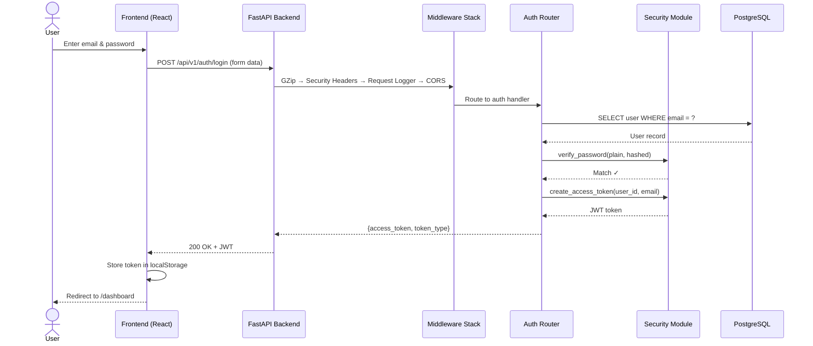
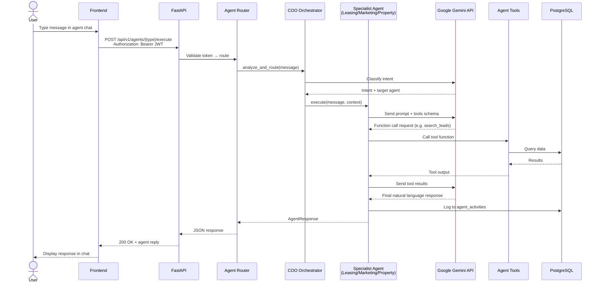
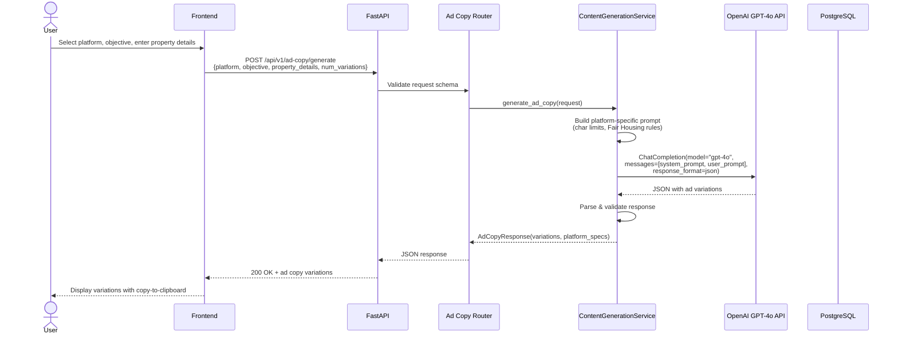
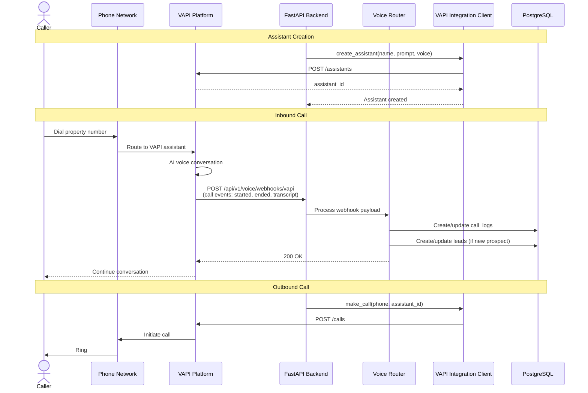
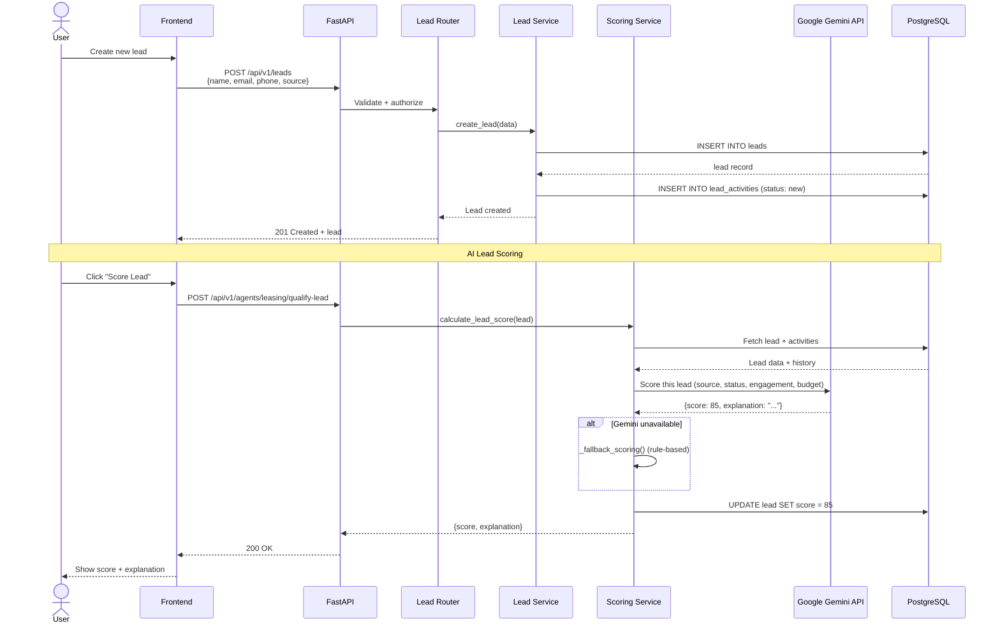
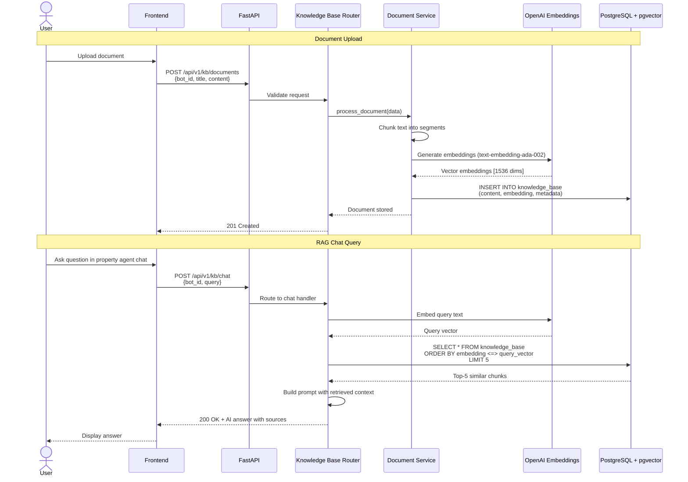
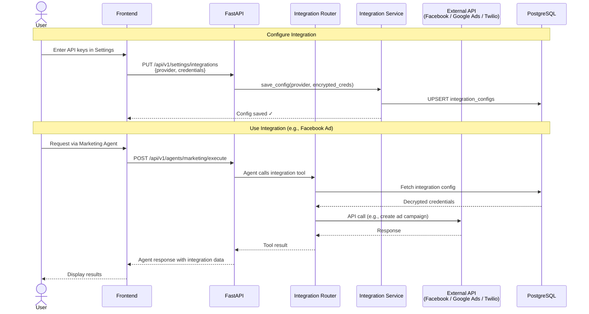
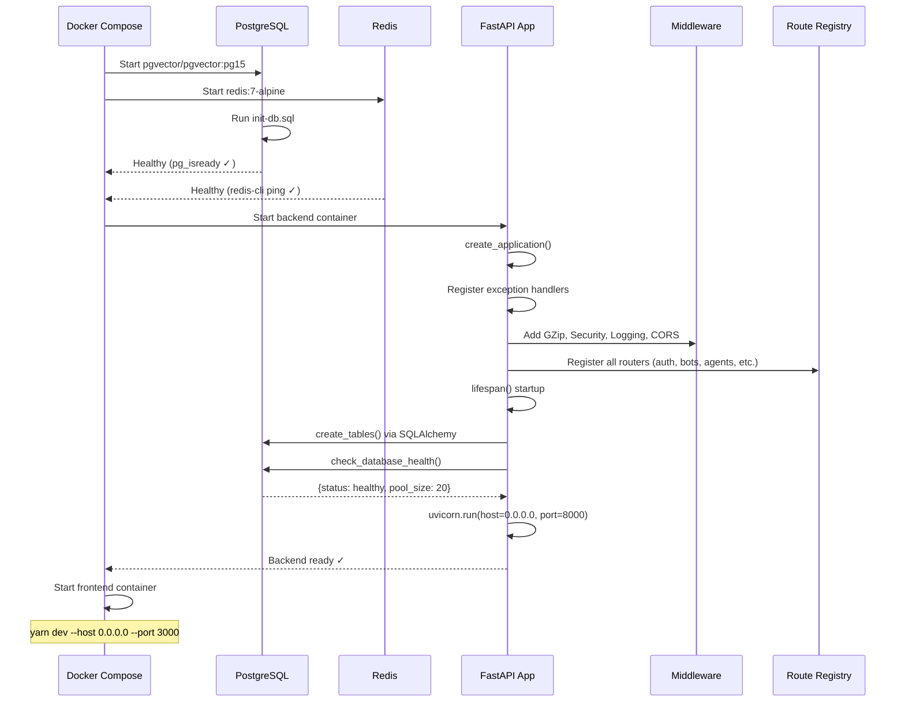

# Backend — Sequence Diagrams

All diagrams use [Mermaid](https://mermaid.js.org/) syntax and render natively on GitHub.

---

## 1. User Authentication Flow

---

## 2. AI Agent Chat Flow (Leasing / Marketing / Property)

---

## 3. Ad Copy Generation Flow (ChatGPT)

---

## 4. Voice Assistant Flow (VAPI)

---

## 5. Lead Management & Scoring Flow

---

## 6. Knowledge Base / RAG Flow

---

## 7. Integration Flow (Facebook / Google Ads / Twilio)

---

## 8. Application Startup Sequence

